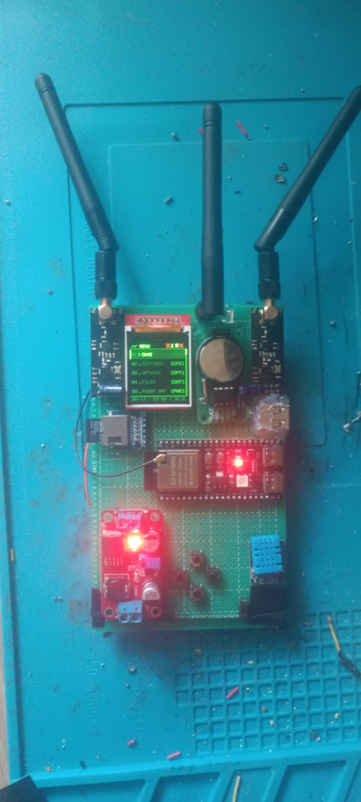
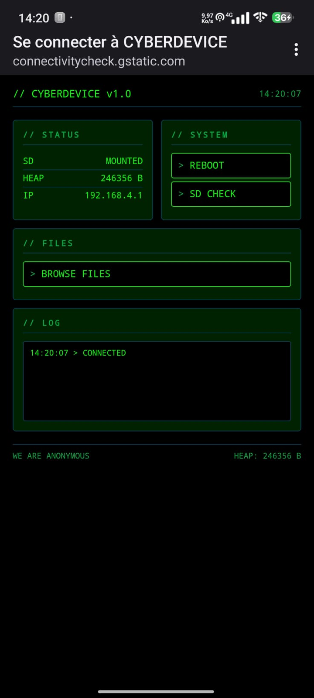
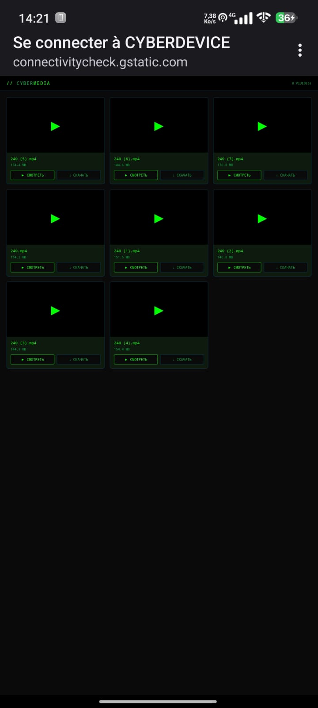
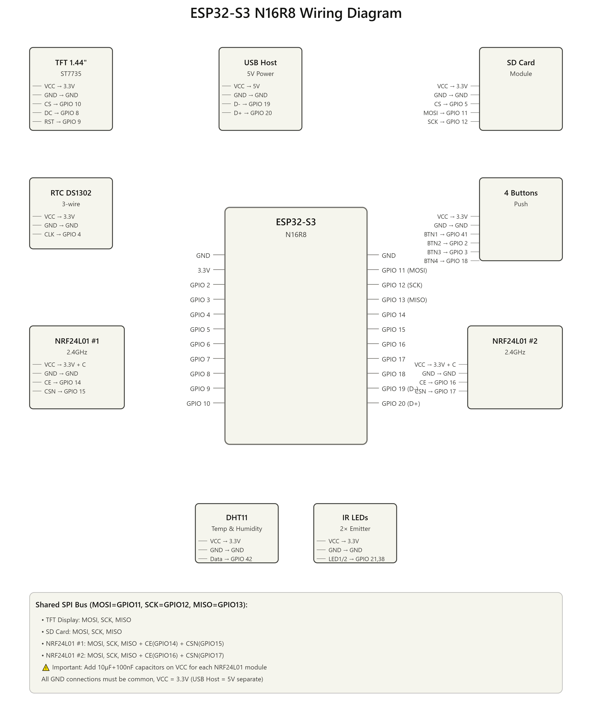

# CYBERDECK

**Cyberpunk ESP32S3 Multi-Tool Device**

Advanced portable cyber deck with WiFi, Bluetooth, NRF24 jamming, BLE spam, IR attacks, dual web servers, SD card media server, games, and AI integration.




## ✨ Features

- **RF Attacks**
  - WiFi Deauth & Beacon Spam
  - BLE Flooding & Advertisement Spam (Apple Juice, Sour Apple, Swift Pair, Samsung, Google Fast Pair, etc.)
  - NRF24 Jammer with PA+LNA (2 modules)
- **Infrared Attacks** – Record & Replay IR signals
- **Dual Web Servers**






  - Admin Panel
  - Media Server (browse & stream videos from SD card)
- **Games** – Tetris + more planned
- **AI Integration** – API
- **Peripherals**
  - SD Card (FAT32) – file storage & media
  - Temperature & Real-Time Clock
- **Cyberpunk Style UI** with menu system

## 🛠️ Hardware Requirements

- ESP32S3
- 2× NRF24L01+ PA+LNA modules
- SD Card Module
- IR LED 
- TFT Display
- USB
- RTC
- DHT11
- 4 Buttons



## 🚀 Getting Started

1. Clone the repository
3. Configure your pins and settings
4. Open in **PlatformIO**
5. Upload the firmware

```bash
pio run -t upload
